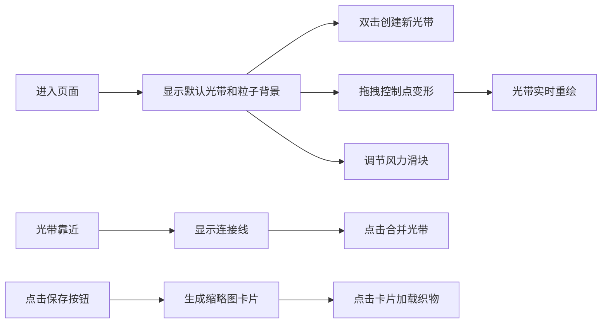

## 1. 产品概述
风痕织机是一款基于WebGL的3D交互式创作工具，用户可以在虚拟三维空间中通过鼠标创建、拖拽和编织飘动的光带，形成富有诗意的织物艺术效果。
- 核心价值：让用户以直观的方式创建动态光影织物，体验数字艺术创作的乐趣
- 目标用户：数字艺术爱好者、设计师、创意工作者

## 2. 核心功能

### 2.1 用户角色
| 角色 | 注册方式 | 核心权限 |
|------|----------|----------|
| 访客用户 | 无需注册 | 创建、编辑、保存和加载光带织物 |

### 2.2 功能模块
1. **3D场景**：深色渐变背景、漂浮粒子、光带渲染、相机控制
2. **光带编辑**：创建光带、拖拽控制点、形状变形、风力飘动效果
3. **光带交互**：光带间连接线、合并光带、力场效果
4. **控制面板**：风力强度调节、保存织物功能
5. **侧边栏**：已保存织物缩略图列表、快速加载功能

### 2.3 页面详情
| 页面名称 | 模块名称 | 功能描述 |
|----------|----------|----------|
| 主页面 | 3D画布区 | 显示三维场景，支持光带创建和编辑交互 |
| 主页面 | 控制面板 | 风力滑块、保存按钮，位于右下角 |
| 主页面 | 侧边栏 | 已保存织物缩略图卡片列表，位于左侧 |

## 3. 核心流程
用户进入页面后，默认看到一条悬浮的光带。可以双击空白处创建新光带，拖拽控制点调整形状，通过风力滑块控制飘动效果。当光带靠近时会产生连接线，点击可合并。用户可保存当前织物到侧边栏，点击缩略图可重新加载。

## 4. 用户界面设计

### 4.1 设计风格
- **设计主题**：深色科技感、神秘诗意、数字艺术
- **主色调**：深蓝灰 #0b1024、深灰 #1f1f2e
- **强调色**：紫色 #6c63ff、金色 #ffd93d
- **光带颜色**：8种预设色（金色、红色、青绿色、灰蓝色、银灰色、橙色、棕色、紫色）
- **面板样式**：半透明白色 (rgba(255,255,255,0.08))、圆角、微妙边框
- **文字颜色**：浅灰 #e0e0e0
- **交互效果**：悬停时透明度提升、轻微上浮2px、0.2秒过渡动画

### 4.2 页面设计概述
| 页面名称 | 模块名称 | UI元素 |
|----------|----------|--------|
| 主页面 | 3D场景 | 深色渐变背景、银色漂浮粒子、光带曲线、控制点光球 |
| 主页面 | 控制面板 | 扁平化细长滑块、保存按钮、标签文字 |
| 主页面 | 侧边栏 | 缩略图卡片网格、卡片悬停放大效果 |

### 4.3 响应性
- 桌面端优先设计
- 侧边栏固定宽度，3D场景自适应剩余空间
- 控制面板固定在右下角

### 4.4 3D场景指引
- **环境**：深色渐变背景（墨蓝到深灰），200颗缓慢漂浮的银色粒子
- **光照**：环境光 + 微弱方向光，光带采用自发光材质
- **相机**：透视相机，支持右键旋转、中键缩放
- **构图**：光带居中，留有充足负空间
- **动画**：光带顶点按正弦波+噪声偏移飘动，粒子透明度循环变化
- **后处理**：光带外发光效果，增强梦幻感
- **性能**：12条光带（每条约8控制点）保持45FPS以上
