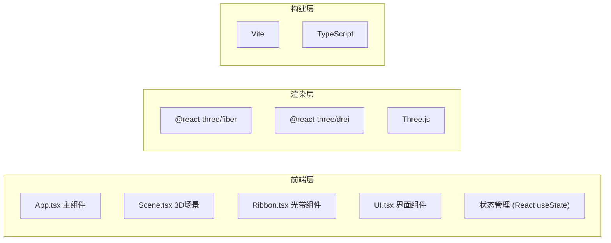

## 1. 架构设计


## 2. 技术描述
- **前端框架**：React@18 + TypeScript@5
- **3D引擎**：Three.js + @react-three/fiber + @react-three/drei
- **构建工具**：Vite@5
- **样式方案**：内联样式 + CSS变量
- **状态管理**：React useState/useRef（轻量级场景）
- **几何计算**：Catmull-Rom样条曲线、正弦波+噪声顶点动画

## 3. 目录结构
```
src/
├── App.tsx          # 主组件，场景初始化、状态管理
├── Scene.tsx        # 3D场景，光带、粒子、连接线管理
├── Ribbon.tsx       # 单个光带组件，样条曲线、顶点动画、拖拽交互
├── UI.tsx           # 控制面板和侧边栏UI
└── main.tsx         # 入口文件
```

## 4. 数据模型

### 4.1 控制点 (ControlPoint)
```typescript
interface ControlPoint {
  id: string;
  x: number;
  y: number;
  z: number;
}
```

### 4.2 光带 (RibbonData)
```typescript
interface RibbonData {
  id: string;
  points: ControlPoint[];
  colorStart: string;
  colorEnd: string;
  emissiveIntensity: number;
  maxWidth: number;
}
```

### 4.3 保存的织物 (SavedFabric)
```typescript
interface SavedFabric {
  id: string;
  name: string;
  ribbons: RibbonData[];
  windStrength: number;
  thumbnail?: string;  // base64图片
  createdAt: number;
}
```

## 5. 核心算法

### 5.1 Catmull-Rom样条插值
- 输入：控制点数组
- 输出：平滑曲线顶点（细分倍数：每段10个点）
- 用途：生成光带路径

### 5.2 顶点飘动动画
- 公式：offset = sin(time * frequency + phase) * amplitude + noise * 0.3
- 风力影响：amplitude = windStrength * 0.05, frequency = windStrength * 0.1
- 实现：使用useFrame在每帧更新顶点位置

### 5.3 控制点拖拽联动
- 影响范围：距离被拖拽点2单位内的控制点
- 衰减系数：0.3 * (1 - distance / maxDistance)
- 用途：模拟布料拉扯的物理感

### 5.4 光带宽度变化
- 沿路径由细变粗再变细
- 公式：width = maxWidth * sin(progress * π)

## 6. 性能优化
- 使用BufferGeometry而非Geometry
- 控制点数量限制在每带8-10个
- 粒子使用Points统一渲染
- 合并检测使用空间哈希或每N帧检测一次
- useFrame中避免不必要的计算
- 缩略图使用离屏Canvas生成
