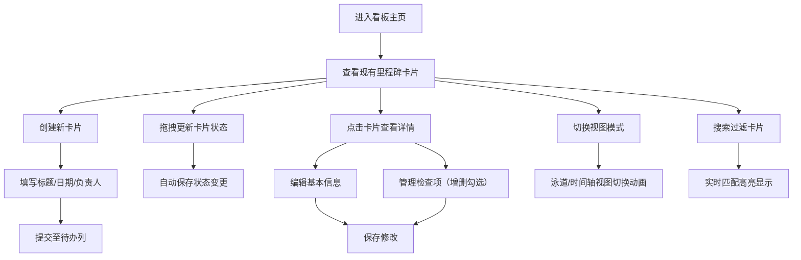

## 1. 产品概述
项目里程碑看板是企业内部工具平台的轻量级项目管理应用，用于跟踪项目关键节点和任务进度。
- 主要用途：团队成员通过可视化看板管理里程碑卡片，实时掌握项目进展，提升协作效率
- 目标价值：提供直观的任务进度展示，降低沟通成本，提高项目交付质量

## 2. 核心功能

### 2.1 用户角色
本应用为企业内部团队协作工具，无复杂权限区分，所有登录用户拥有相同操作权限。
| 角色 | 核心权限 |
|------|----------|
| 团队成员 | 创建、编辑、删除里程碑卡片，拖拽更新状态，切换视图，搜索过滤 |

### 2.2 功能模块
1. **看板主界面**：顶部搜索栏、视图切换按钮、三列泳道或时间轴视图、新建卡片按钮
2. **里程碑卡片**：标题、截止日期、负责人、完成进度、详情弹窗、检查项管理
3. **拖拽交互**：卡片在三列间拖拽移动、排序，拖拽视觉反馈
4. **视图切换**：泳道视图（三列并行）与时间轴视图（按日期排序水平展示）
5. **搜索过滤**：实时关键词搜索，匹配高亮，不匹配卡片半透明禁用

### 2.3 页面详情
| 页面名称 | 模块名称 | 功能描述 |
|-----------|-------------|---------------------|
| 看板主页 | 顶部导航栏 | Logo展示、搜索框（底部边框滑动动效）、视图切换按钮、新建卡片按钮 |
| 看板主页 | 泳道视图 | 三列（待办/进行中/已完成）并排，支持卡片拖拽排序和跨列移动 |
| 看板主页 | 时间轴视图 | 水平时间线布局，卡片按截止日期排序展示 |
| 看板主页 | 卡片组件 | 展示标题、日期、负责人、进度条，点击展开详情弹窗 |
| 详情弹窗 | 编辑区域 | 可编辑标题、截止日期（渐变过渡动画）、负责人 |
| 详情弹窗 | 检查项列表 | 添加/删除检查项，勾选时打勾动画，实时计算完成进度 |

## 3. 核心流程
用户进入看板主页面后，可通过新建按钮创建里程碑卡片，卡片自动添加至"待办"列。通过拖拽操作可将卡片在三列间移动以更新状态。点击卡片可展开详情弹窗进行信息编辑和检查项管理。用户可随时切换泳道视图或时间轴视图，使用顶部搜索框快速定位卡片。

## 4. 用户界面设计

### 4.1 设计风格
- 主色调：蓝紫色渐变（#667eea → #764ba2），作为主题色用于按钮、标题高亮等
- 背景色：浅灰白（#f5f7fa），营造简洁专业的企业工具氛围
- 列背景色：待办（#ffe0e0 浅红）、进行中（#fff3cd 浅黄）、已完成（#d4edda 浅绿）
- 按钮样式：圆角8px，悬停时颜色加深0.2s过渡
- 卡片样式：圆角12px，box-shadow: 0 2px 8px rgba(0,0,0,0.1)
- 字体：使用系统无衬线字体，标题16px粗体，正文14px常规
- 图标风格：使用lucide-react线性图标，保持简洁统一

### 4.2 页面设计概述
| 页面名称 | 模块名称 | UI元素 |
|-----------|-------------|-------------|
| 看板主页 | 顶部导航栏 | 渐变背景主题色、左侧Logo、中间搜索框（聚焦时底部边框扩展）、右侧视图切换与新建按钮 |
| 看板主页 | 泳道列 | 列标题带图标和卡片计数、彩色背景区分状态、卡片区域可滚动 |
| 看板主页 | 卡片 | 白色背景、标题粗体、日期标签、负责人头像占位、进度条（蓝紫渐变） |
| 看板主页 | 时间轴视图 | 水平日期刻度线、卡片按日期分布、连接线指示时间顺序 |
| 详情弹窗 | 整体 | 半透明遮罩、从中心放大淡入/缩小淡出、圆角16px、最大宽度500px |
| 详情弹窗 | 检查项 | 左侧勾选框（打勾动画）、右侧文本、删除按钮悬停显示 |

### 4.3 响应式
- 桌面端（>768px）：三列等宽泳道布局
- 平板端（≤768px）：两列并排，第三列换行
- 手机端（≤480px）：单列垂直堆叠
- 所有交互元素保持最小触控区域44px
- 弹窗在移动端自适应宽度，边缘留白16px

### 4.4 动画效果
- 卡片拖拽：0.3s cubic-bezier过渡，缩放1.02倍，阴影加深
- 目标列高亮：拖拽悬停时背景色加深，边框闪烁
- 视图切换：卡片交错飞入动画（animation-delay递增）
- 弹窗打开：从中心scale(0.8) opacity(0) 过渡至 scale(1) opacity(1)
- 搜索框聚焦：底部边框从中心向两侧扩展至全宽
- 检查项勾选：对勾从无到有绘制动画，背景色变绿
- 创建卡片日期选择器：高度与透明度渐变过渡
