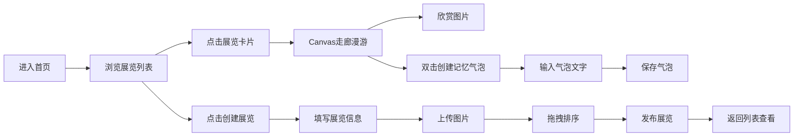

## 1. 产品概述

"记忆走廊"是一个数字展览平台，让用户能够策划、布置并在线游览由自己上传的图像和文字片段组成的虚拟展览。每条长廊按主题和情感标签分类，参观者可以留下"记忆气泡"评论。

- **核心目标**：为独立策展人提供一个沉浸式的虚拟展览空间，让用户以独特的走廊漫游体验浏览和互动
- **目标用户**：独立策展人、艺术爱好者、想要展示个人作品集的创作者
- **市场价值**：填补虚拟策展领域的创新空白，提供高度沉浸感和互动性的数字展览体验

## 2. 核心功能

### 2.1 用户角色

| 角色 | 注册方式 | 核心权限 |
|------|----------|----------|
| 策展用户 | 无需注册，直接使用 | 创建展览、上传图片、布置展览 |
| 参观用户 | 无需注册，直接浏览 | 浏览展览、留下记忆气泡评论 |

### 2.2 功能模块

1. **展览列表页**：3列响应式网格展示所有展览卡片，支持主题渐变配色
2. **展览创建页**：输入名称、选择情感主题、上传图片、拖拽排序
3. **展览浏览页**：Canvas虚拟走廊漫游，支持拖拽/滚动移动视角，记忆气泡互动

### 2.3 页面详情

| 页面名称 | 模块名称 | 功能描述 |
|---------|----------|----------|
| 展览列表页 | 展览卡片网格 | 3列响应式布局，主题渐变背景，悬停动效，毛玻璃图片效果 |
| 展览列表页 | 导航栏 | 深色主题，创建展览入口 |
| 展览创建页 | 表单区域 | 名称输入（20字限制）、情感主题选择（4种渐变配色）、图片上传（最多6张，2MB限制） |
| 展览创建页 | 缩略图网格 | 上传进度条、拖拽排序、图片描述输入 |
| 展览创建页 | 提交按钮 | 保存展览，成功/失败反馈 |
| 展览浏览页 | Canvas走廊 | 横向无限滚动走廊，墙壁挂图像，地板木纹效果，砖纹纹理 |
| 展览浏览页 | 记忆气泡系统 | 双击创建气泡，可编辑文字（50字），漂浮动画，保存后固定位置轻微漂浮 |
| 展览浏览页 | 交互控制 | 鼠标拖拽/滚轮移动视角，惯性滑动效果 |

## 3. 核心流程

用户进入首页浏览展览列表，选择感兴趣的展览点击进入浏览。在浏览页面可以漫游走廊，欣赏图片，双击图片附近创建记忆气泡。用户也可以创建自己的展览，选择主题、上传图片、填写描述后发布。

## 4. 用户界面设计

### 4.1 设计风格

- **主背景色**：#1a1a2e（深蓝色）
- **侧栏背景**：#16213e
- **卡片背景**：#0f3460
- **文字主色**：#e0e0e0（浅灰色）
- **情感主题配色**：
  - 怀旧：暖橙 #ff9a44 → #fecfef
  - 希望：青绿 #30cfd0 → #a8edea
  - 忧伤：雾蓝 #667eea → #764ba2
  - 狂喜：焰红 #f12711 → #f5af19

- **字体**：使用优雅的衬线字体搭配现代无衬线字体
- **按钮风格**：圆角设计，按下时缩放0.95倍，0.15秒过渡
- **布局风格**：卡片式布局，深度阴影，层次感强
- **动画风格**：所有动画使用ease-out缓动，0.3-0.6秒时长

### 4.2 页面设计概述

| 页面名称 | 模块名称 | UI元素 |
|---------|----------|--------|
| 展览列表页 | 展览卡片 | 300×400px，圆角12px，渐变背景，悬停上移8px+外发光，0.3秒过渡 |
| 展览列表页 | 卡片图片 | 300×200px，毛玻璃效果（backdrop-filter: blur(4px)，悬停清晰+放大1.1倍 |
| 展览创建页 | 上传进度条 | 0.3秒宽度变化，ease-out |
| 展览创建页 | 错误反馈 | 按钮抖动两次（5px，0.1秒）+ 红色提示条 |
| 展览浏览页 | Canvas走廊 | 径向渐变背景（#0f0f23→#1a1a33），砖纹纹理，木地板效果 |
| 展览浏览页 | 图像裱框 | 4px边框 #4a4a4a，淡入上移动画（0.6秒ease-out） |
| 展览浏览页 | 记忆气泡 | 白色半透明背景rgba(255,255,255,0.15)，圆角16px，内发光2px #ffffff 0.3透明度 |
| 展览浏览页 | 气泡动画 | 向上漂浮-0.3px/帧，水平偏移±0.1px随机，大小正弦变化20-30px周期2秒 |

### 4.3 响应式设计

- **桌面优先**设计，移动端自适应
- **768px以下**：展览列表切换为单列布局，卡片宽度100%减24px边距
- **触控优化**：触摸拖拽支持，按钮最小触控区域44×44px

### 4.4 Canvas场景设计

- **背景**：从#0f0f23到#1a1a33的径向渐变
- **墙壁纹理**：随机半透明线条，透明度0.03，间距30px
- **地板**：深棕色#3e2723，细光泽条纹模拟木地板
- **图像展示**：裱框画形式，4px边框#4a4a4a
- **视角控制**：鼠标拖拽+滚轮，惯性滑动0.5秒逐渐减速
- **渲染帧率**：保持30FPS以上，单次渲染≤16ms

