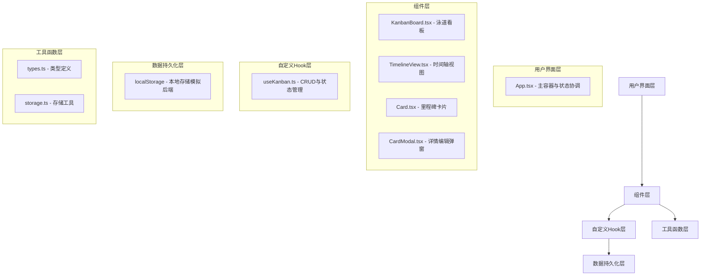

## 1. 架构设计
本项目为纯前端React应用，采用组件化分层架构，数据通过localStorage进行本地持久化存储。



## 2. 技术描述
- 前端框架：React@18 + TypeScript
- 构建工具：Vite@5（开启React Fast Refresh）
- 状态管理：React useState + 自定义Hook（useKanban）
- 拖拽库：react-beautiful-dnd
- 日期处理：dayjs
- ID生成：uuid
- 样式方案：原生CSS + CSS Modules（或全局CSS配合BEM命名）
- 后端：无，使用localStorage模拟数据持久化
- 数据存储：localStorage，支持至少100张卡片流畅操作

## 3. 文件结构与调用关系
```
e:\solo\VersionFastPro\tasks\auto8\
├── index.html              # 入口HTML，加载/src/main.tsx
├── package.json            # 依赖与脚本配置
├── vite.config.js          # Vite构建配置（React + TS + Fast Refresh）
├── tsconfig.json           # TypeScript严格模式配置
└── src/
    ├── main.tsx            # React入口 → 渲染App组件
    ├── App.tsx             # 主组件（状态提升、视图切换、搜索过滤）
    ├── App.css             # 全局样式与主题变量
    ├── KanbanBoard.tsx     # 看板组件（三列泳道、拖拽）
    ├── KanbanBoard.css     # 看板样式
    ├── TimelineView.tsx    # 时间轴视图组件
    ├── TimelineView.css    # 时间轴样式
    ├── Card.tsx            # 卡片组件（展示、弹窗）
    ├── Card.css            # 卡片样式
    ├── types.ts            # TypeScript类型定义
    └── hooks/
        └── useKanban.ts    # 自定义Hook（CRUD、localStorage持久化）
```

**数据流向：**
1. `main.tsx` → 渲染 `App.tsx`
2. `App.tsx` → 调用 `useKanban()` 获取状态与操作方法
3. `useKanban.ts` → 从 `localStorage` 加载数据，管理卡片状态
4. `App.tsx` → 向 `KanbanBoard.tsx` / `TimelineView.tsx` 传递 `cards`、`onDragEnd`、`onCardClick`
5. `KanbanBoard.tsx` → 向 `Card.tsx` 传递单张卡片数据、拖拽属性
6. `Card.tsx` → 调用 `onUpdate` 回调向上传递编辑结果
7. `App.tsx` → 搜索过滤逻辑作用于卡片列表，控制渲染

## 4. 数据模型定义

### 4.1 TypeScript类型

```typescript
// 卡片状态枚举
export type CardStatus = 'todo' | 'in_progress' | 'done';

// 检查项接口
export interface CheckItem {
  id: string;
  text: string;
  completed: boolean;
}

// 里程碑卡片接口
export interface MilestoneCard {
  id: string;
  title: string;
  dueDate: string; // ISO格式日期
  assignee: string;
  status: CardStatus;
  checkItems: CheckItem[];
  order: number; // 同列内排序
  createdAt: string;
  updatedAt: string;
}

// 看板视图类型
export type ViewMode = 'kanban' | 'timeline';
```

### 4.2 localStorage存储结构
- Key: `milestone_kanban_cards`
- Value: `MilestoneCard[]` JSON数组字符串

## 5. 核心组件与Hook设计

### 5.1 useKanban Hook
暴露接口：
- `cards: MilestoneCard[]` - 所有卡片
- `addCard(data: Omit<MilestoneCard, 'id' | 'createdAt' | 'updatedAt' | 'order'>): void`
- `updateCard(id: string, data: Partial<MilestoneCard>): void`
- `deleteCard(id: string): void`
- `reorderCards(sourceId: string, destinationId: string, sourceIndex: number, destIndex: number): void`
- `addCheckItem(cardId: string, text: string): void`
- `toggleCheckItem(cardId: string, itemId: string): void`
- `removeCheckItem(cardId: string, itemId: string): void`

### 5.2 性能优化策略
- 搜索过滤：使用 `useMemo` 缓存过滤结果，确保响应时间 <50ms
- 拖拽优化：使用 CSS `transform` 而非 layout 属性，保持60FPS
- 组件渲染：使用 `React.memo` 包裹 Card 组件避免不必要重渲染
- 列表虚拟化：若超过100张卡片可考虑虚拟滚动（当前需求100张直接渲染即可）
- localStorage操作：防抖写入，避免频繁IO

## 6. 动画实现方案
| 动画效果 | 实现方式 |
|---------|---------|
| 卡片拖拽缩放阴影 | react-beautiful-dnd snapshot + CSS transform/box-shadow |
| 目标列高亮 | Droppable snapshot.isDraggingOver + CSS类切换 |
| 视图切换交错飞入 | CSS animation + animation-delay 递增 |
| 弹窗缩放淡入 | CSS keyframes (scale 0.8→1, opacity 0→1) |
| 搜索框边框滑动 | CSS ::after伪元素 width:0→100% transition |
| 检查项打勾 | SVG stroke-dasharray 绘制动画 |
| 日期选择器渐变 | CSS max-height + opacity transition |
| 按钮悬停过渡 | CSS transition: background-color 0.2s |
