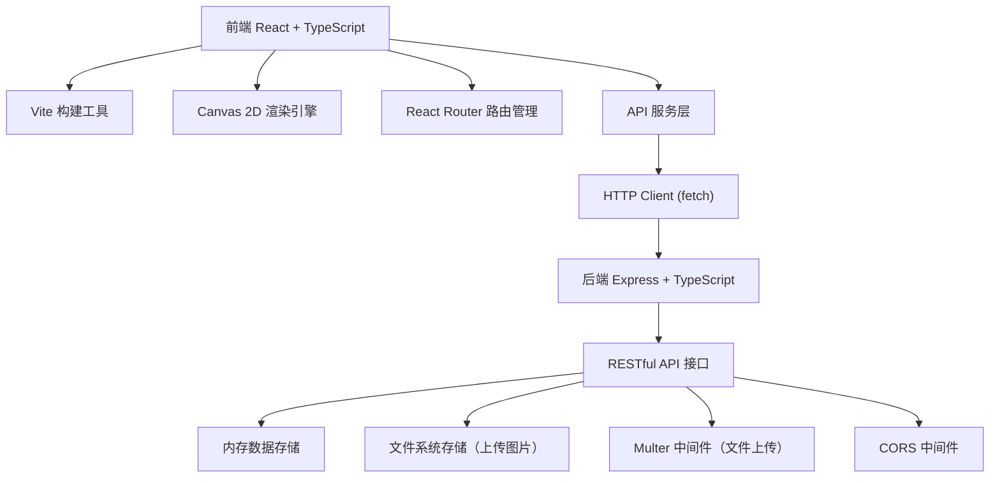
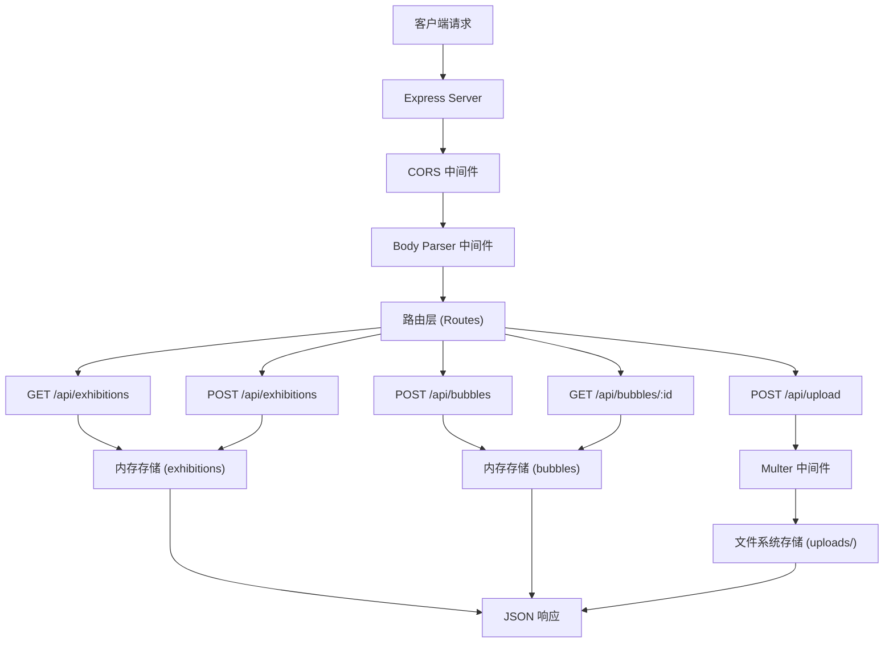
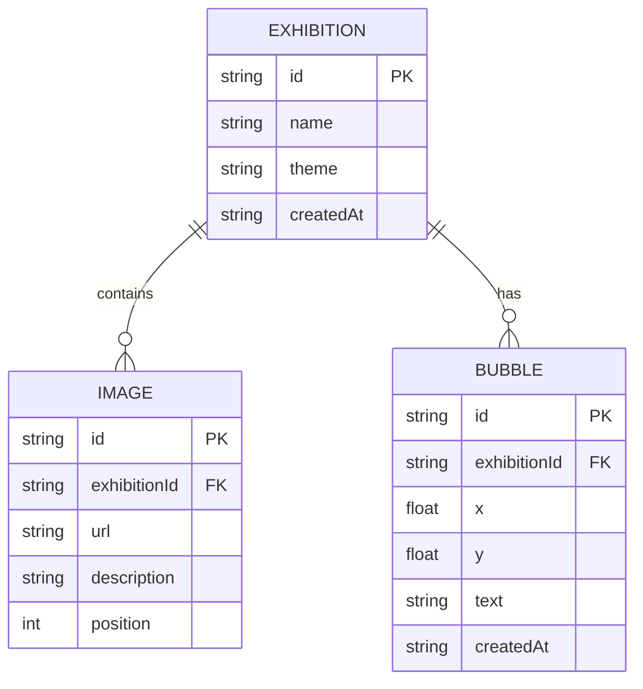

## 1. 架构设计



## 2. 技术描述

- **前端框架**：React 18 + TypeScript
- **构建工具**：Vite 5
- **路由管理**：React Router DOM 6
- **状态管理**：React Hooks (useState, useEffect, useRef)
- **Canvas渲染**：原生Canvas 2D API
- **样式方案**：CSS Modules + 内联样式
- **后端框架**：Express 4 + TypeScript
- **文件上传**：Multer 1.4
- **跨域处理**：CORS 2.8
- **唯一ID**：UUID 9
- **编程语言**：TypeScript 5（严格模式）
- **包管理器**：npm

## 3. 路由定义

| 前端路由 | 页面组件 | 功能 |
|----------|----------|------|
| `/` | ExhibitionList | 展览列表页 |
| `/create` | CreateExhibition | 展览创建页 |
| `/exhibition/:id` | ViewExhibition | 展览浏览页 |

| 后端API路由 | 方法 | 功能 |
|-------------|------|------|
| `/api/exhibitions` | GET | 获取展览列表 |
| `/api/exhibitions` | POST | 创建新展览 |
| `/api/upload` | POST | 上传图片文件 |
| `/api/bubbles` | POST | 保存记忆气泡 |
| `/api/bubbles/:exhibitionId` | GET | 获取指定展览的气泡 |

## 4. API 定义

### TypeScript 类型定义

```typescript
// 情感主题类型
type EmotionTheme = 'nostalgia' | 'hope' | 'sadness' | 'ecstasy'

// 图片数据
interface ImageItem {
  id: string
  url: string
  description: string
  position: number
}

// 展览数据
interface Exhibition {
  id: string
  name: string
  theme: EmotionTheme
  images: ImageItem[]
  createdAt: string
}

// 记忆气泡
interface Bubble {
  id: string
  exhibitionId: string
  x: number
  y: number
  text: string
  createdAt: string
}

// 创建展览请求
interface CreateExhibitionRequest {
  name: string
  theme: EmotionTheme
  images: Omit<ImageItem, 'id'>[]
}

// 上传图片响应
interface UploadResponse {
  url: string
  filename: string
}

// 保存气泡请求
interface SaveBubbleRequest {
  exhibitionId: string
  x: number
  y: number
  text: string
}
```

### 请求/响应格式

**GET /api/exhibitions**
- 响应：`Exhibition[]`

**POST /api/exhibitions**
- 请求体：`CreateExhibitionRequest`
- 响应：`Exhibition`

**POST /api/upload**
- 请求体：`multipart/form-data` (file field: "image")
- 响应：`UploadResponse`

**POST /api/bubbles**
- 请求体：`SaveBubbleRequest`
- 响应：`Bubble`

**GET /api/bubbles/:exhibitionId**
- 响应：`Bubble[]`

## 5. 服务器架构图



## 6. 数据模型

### 6.1 数据模型定义



### 6.2 内存存储结构

```typescript
// 内存存储对象
interface DataStore {
  exhibitions: Exhibition[]
  bubbles: Map<string, Bubble[]>  // key: exhibitionId
}

// 初始化存储
const store: DataStore = {
  exhibitions: [],
  bubbles: new Map()
}
```

## 7. 文件结构

```
记忆走廊/
├── package.json
├── vite.config.js
├── tsconfig.json
├── index.html
├── src/
│   ├── main.tsx              # React入口
│   ├── App.tsx               # 主应用组件（路由管理）
│   ├── types/                # 类型定义
│   │   └── index.ts
│   ├── api/                  # API服务层
│   │   └── client.ts
│   ├── components/           # 组件目录
│   │   ├── ExhibitionCanvas.tsx    # Canvas走廊组件
│   │   ├── ExhibitionCard.tsx      # 展览卡片组件
│   │   ├── MemoryBubble.tsx        # 记忆气泡组件
│   │   ├── ImageUploader.tsx       # 图片上传组件
│   │   └── ThemeSelector.tsx       # 主题选择器
│   ├── pages/                # 页面组件
│   │   ├── ExhibitionList.tsx      # 展览列表页
│   │   ├── CreateExhibition.tsx    # 展览创建页
│   │   └── ViewExhibition.tsx      # 展览浏览页
│   ├── utils/                # 工具函数
│   │   ├── canvas.ts              # Canvas渲染工具
│   │   ├── animation.ts           # 动画工具
│   │   └── theme.ts               # 主题配色工具
│   └── styles/               # 样式文件
│       ├── global.css
│       └── animations.css
├── server/
│   ├── index.ts              # Express服务器入口
│   ├── types.ts              # 后端类型定义
│   ├── routes/               # 路由
│   │   ├── exhibitions.ts
│   │   ├── upload.ts
│   │   └── bubbles.ts
│   ├── middleware/           # 中间件
│   │   └── multer.ts
│   └── store/                # 数据存储
│       └── index.ts
└── uploads/                  # 上传图片存储目录
```

## 8. 数据流向

### 前端数据流

```
用户操作 → 组件事件处理 → API调用 → 响应返回 → 状态更新 → 重新渲染
```

### 后端数据流

```
HTTP请求 → 中间件处理 → 路由匹配 → 控制器逻辑 → 数据操作 → JSON响应
```

### Canvas组件数据流

```
展览数据 → Canvas组件 → 初始化场景 → requestAnimationFrame循环 → 渲染走廊/图像/气泡 → 用户交互 → 气泡创建/保存API
```

## 9. 性能优化

- **Canvas渲染**：使用requestAnimationFrame，单次渲染≤16ms
- **离屏渲染**：预渲染静态元素到离屏Canvas
- **视口裁剪**：只渲染可见区域的图像和气泡
- **图片优化**：限制上传大小≤2MB，前端压缩预览
- **动画优化**：使用transform和opacity属性，避免重排
- **防抖节流**：滚动和拖拽事件使用节流处理

